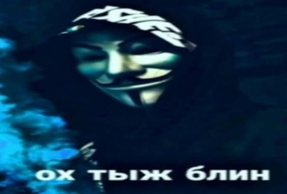
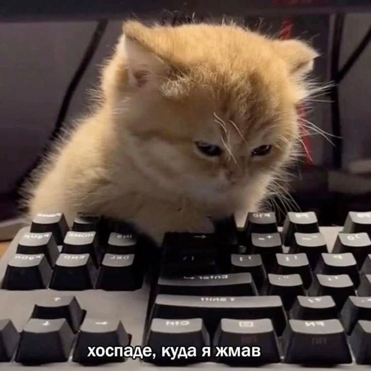
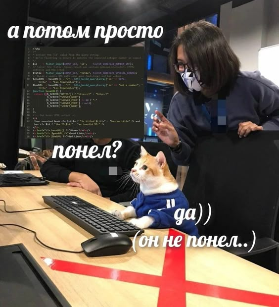

# Привет! Я начинающий Web Developer

Добро пожаловать в мой репозиторий! Здесь собраны проекты, которые я создаю, осваивая мир веб-разработки. На данный момент я активно изучаю и применяю на практике такие инструменты, как **HTML**, **CSS** и **Git**. Я уделяю большое внимание мелочам и постоянно стремлюсь улучшать свои навыки, работая с проектами, основанными на макетах из **Figma**.

## О моем пути в веб-разработке

Моя история в веб-разработке началась с простого интереса к тому, как создаются сайты и приложения. С тех пор этот интерес перерос в страсть, которая каждый день вдохновляет меня учиться чему-то новому и экспериментировать с кодом. Веб-разработка — это удивительная сфера, где каждый день появляются новые инструменты, фреймворки и подходы к решению задач. Это бесконечный процесс обучения, и именно эта динамика привлекает меня больше всего.

В настоящий момент мой фокус направлен на изучение базовых технологий: **HTML**, **CSS**, **Git** и **JavaScript**. Я активно использую эти инструменты для создания адаптивных и эстетичных веб-страниц, работая с макетами из Figma. Каждый день я учусь новому: будь то тонкости верстки с использованием **Flexbox** и **Grid**, работа с системой контроля версий **Git**, или улучшение производительности веб-сайтов. Эти ежедневные шаги помогают мне продвигаться вперед и постоянно расти как разработчику.

## Мои проекты и работа с Figma

Один из ключевых аспектов моей работы — это проекты по макетам из **Figma**. Я считаю, что качественный дизайн является основой любого успешного веб-приложения, и работа с готовыми макетами помогает мне развивать навыки верстки и внимания к деталям. Каждый проект — это возможность погрузиться в процесс создания пользовательского интерфейса и воплотить в коде ту эстетику и функциональность, которую предлагает дизайн.

Работа над этими проектами включает:

- **Адаптивную верстку**. Я активно использую такие инструменты, как **Flexbox** и **CSS Grid**, чтобы создавать макеты, которые будут отлично выглядеть на любом экране — от смартфонов до больших мониторов.
- **Интерактивные элементы**. Помимо верстки, я стремлюсь делать сайты удобными и интерактивными, используя стили и анимации на CSS.
- **Кроссбраузерную совместимость**. Важно, чтобы сайты работали одинаково хорошо в различных браузерах, и я стараюсь учитывать это на каждом этапе разработки.
- **Оптимизацию производительности**. Быстрота загрузки и работы сайта важна как для пользователей, так и для SEO, поэтому я постоянно изучаю методы оптимизации кода и ресурсов.

Каждый проект — это не просто учебное задание, а полноценный этап моего профессионального роста. Я стараюсь делать каждый сайт так, как если бы это был реальный заказ клиента, придавая внимание каждой мелочи и прорабатывая все возможные сценарии.

## Что я уже умею и чему учусь

На данный момент я освоил такие инструменты, как **Git**, **HTML**, **CSS**, и продолжаю углубляться в их возможности. Система контроля версий **Git** стала для меня незаменимым помощником, когда речь идет о работе над проектами. Она позволяет мне эффективно управлять изменениями в коде, создавать ветки для новых функций и быстро откатываться к стабильным версиям при необходимости.

Я также активно изучаю **CSS**, включая его продвинутые возможности, такие как **Flexbox** и **CSS Grid**. Эти технологии позволяют создавать гибкие и адаптивные макеты, которые могут подстраиваться под различные устройства и экраны. Я учусь создавать сайты, которые не только красиво выглядят, но и удобны в использовании.

Моя главная цель — углубиться в изучение **JavaScript**, чтобы добавить интерактивность своим проектам и начать работать с более сложными веб-приложениями. Это следующий этап моего развития, и я с нетерпением жду возможности начать его осваивать.

## Мои цели и стремления

Как начинающий веб-разработчик, я ставлю перед собой амбициозные цели. Я хочу не просто создавать сайты, но делать это на высоком уровне, используя передовые технологии и лучшие практики разработки. Моя долгосрочная цель — стать опытным фронтенд-разработчиком, освоить фреймворки, такие как **React** или **Vue.js**, и уметь создавать сложные веб-приложения с нуля.

Помимо этого, я стремлюсь развивать soft skills — умение работать в команде, эффективно планировать свою работу и находить нестандартные решения задач. Я уверен, что веб-разработка — это не только про код, но и про мышление, креативность и умение взаимодействовать с другими людьми.

## Почему я это делаю

Веб-разработка для меня — это не просто набор технологий и инструментов. Это возможность воплощать идеи в жизнь, решать реальные проблемы и делать мир немного лучше с помощью своих умений. Каждый сайт, который я создаю, — это шанс сделать чей-то опыт работы с интернетом более приятным и удобным. Я верю, что через свои проекты я смогу оставить свой след в цифровом мире.

## Присоединяйтесь к моему пути!

Если вам интересно следить за моим прогрессом и развитием, приглашаю вас подписаться на мой [телеграм-канал "Группа К1НО"](https://t.me/gruppa_k1no). Здесь я делюсь своими проектами, мыслями о веб-разработке и веселыми мемами. Также, если у вас есть вопросы, предложения или идеи, не стесняйтесь написать мне через [Telegram](https://t.me/wladimir_veredyuk) или создать issue в этом репозитории. Я всегда рад новым знакомствам и идеям!

Спасибо, что заглянули в мой репозиторий. Надеюсь, вам понравится то, что вы здесь увидите, и до скорого!